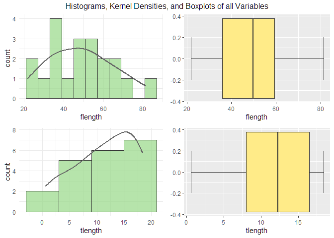
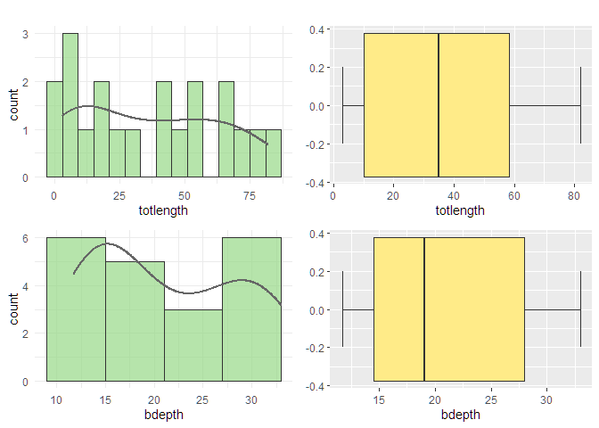
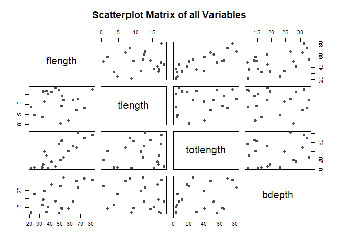
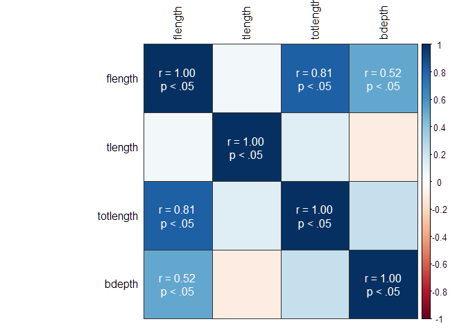
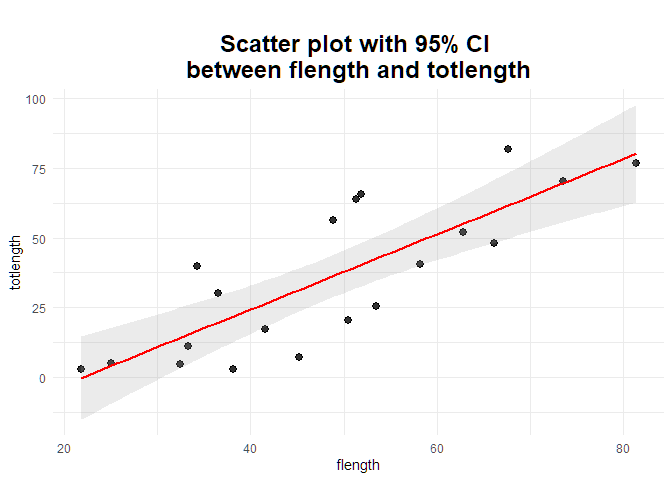
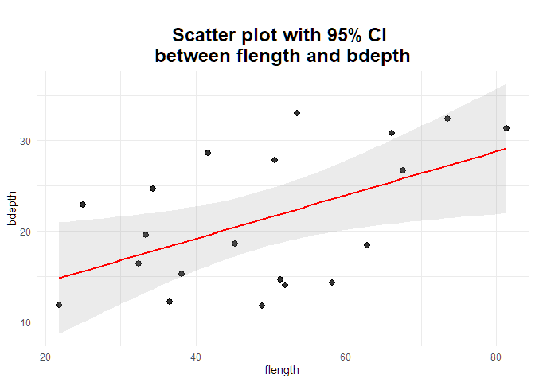

Introduction
============

This is an an analysis of some basic perch data (in a .csv file) from an
old class of mine in biostatistics. The purpose of this report was to
mainly show my analytic abilities, including my ability to visualize
data.

Loading the data and data pre-processing/cleaning
-------------------------------------------------

Let’s first load the dataset and preview it:

    perch<-read.csv("Q4.csv", header=TRUE)
    head(perch)

    ##   flength tlength totlength bdepth
    ## 1    32.4     3.7       4.5   16.4
    ## 2    25.0     4.7       4.8   22.9
    ## 3    21.8     8.8       2.9   11.8
    ## 4    38.1    15.4       2.9   15.2
    ## 5    45.2    18.4       7.0   18.6
    ## 6    33.3    16.7      11.1   19.5

We can also see how many observations there are per variable, and what
class each variables is:

    str(perch)

    ## 'data.frame':    20 obs. of  4 variables:
    ##  $ flength  : num  32.4 25 21.8 38.1 45.2 33.3 41.6 50.5 53.5 36.5 ...
    ##  $ tlength  : num  3.7 4.7 8.8 15.4 18.4 16.7 16.4 0.6 12.2 16.9 ...
    ##  $ totlength: num  4.5 4.8 2.9 2.9 7 11.1 17.3 20.4 25.4 30 ...
    ##  $ bdepth   : num  16.4 22.9 11.8 15.2 18.6 19.5 28.6 27.8 33 12.2 ...

Let’s `append` our data.frame so we do not need to specify variable
names from the dataset each time.

We can also quickly build a function to show us how many missing values
there are per variable (stored in `nmiss`), and consequently, what
percentage of the data is missing per variable (stored in `p_miss`).

    nmiss<-vector()
    p_miss<-vector()
    for (i in 1:ncol(perch)) {
      nmiss<-append(nmiss, sum(is.na(perch[[i]]))
      )
      p_miss<-append(p_miss, nmiss[i]/length(perch[[i]])
      )
    }
    perch.info<-data.frame(var_name=names(perch), nmiss, p_miss)
    perch.info

    ##    var_name nmiss p_miss
    ## 1   flength     0      0
    ## 2   tlength     0      0
    ## 3 totlength     0      0
    ## 4    bdepth     0      0

No missing data… this makes it easy. Let’s now draw some plots to
visualize our data.

Exploratory analysis: data visualization
----------------------------------------

The `ggplot2` package in R allows us to make some lovely-looking plots.
Let’s run some histograms (frequencies) and kernel density plots:

I can use the `psych` package in R to get some more detailed descriptive
information across all my variables. The skewness of each variable
appears to correspond appropriately with what we were seeing in our
univariate plots.

    ##           vars  n  mean    sd median trimmed   mad  min  max range  skew
    ## flength      1 20 48.69 16.22  49.65   48.26 19.50 21.8 81.4  59.6  0.26
    ## tlength      2 20 11.31  5.56  12.30   11.74  6.30  0.6 18.4  17.8 -0.53
    ## totlength    3 20 36.09 26.98  34.95   34.84 38.40  2.9 82.0  79.1  0.23
    ## bdepth       4 20 21.24  7.54  19.05   20.99  9.19 11.7 33.0  21.3  0.27
    ##           kurtosis   se
    ## flength      -0.58 3.63
    ## tlength      -0.86 1.24
    ## totlength    -1.38 6.03
    ## bdepth       -1.51 1.69

I’ll now draw a scatterplot matrix across all variables to see if there
are any possible linear trends. This is an easy way to perform some
basic/introductory bivariate analyses across all our variables to better
understand what is happending in the dataset (i.e., what patterns
may/may not be present, basic data visualization).

A scatterplot matrix would likely be feasible given that we are only
working with 4 variables in this dataset. For larger datasets, we may
want to skip this step and go straight to a correlation
matrix/correlation matrix plot.

No obvious linear trends, except for perhaps between flength and
totlength.

Let’s load the `corrplot` package in R to examine any potential linear
trends further. The `corrplot` package will let us draw a correlation
matrix between all variables. The matrix will tell us which two
variables have a stronger linear trend (higher correlation) compared to
any other pairs.

I’ll place the results of a significance test of each correlation on
top.For aesthetic reasons, I’m only displaying whether the correlation
was found to be statistically significant (p &lt; .05).

Which variables in my dataset had statistically significant correlations
(p &lt; .05), ignoring those along the diagnoal?

    ## [1] "totlength" "bdepth"    "flength"

We have a list of some variables which look like they could be suitable
for perhaps, linear regression, or something similar of the sort.

NOTE: Recall, I am only performing a data pre-processing/exploratory
analysis here, and not a full-on modeling procedure, as the intent of
this report was just to showcase my data visualization/report-writing
abilities. There is not much to visualize once we are building our
statistical models (except perhaps the diagnostic plots)!
